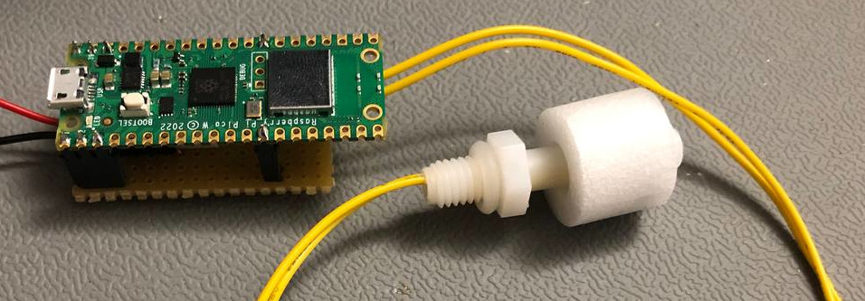

# HoFaLab Wassermelder
A simple water alarm using a float switch and a Raspberry Pi Pico W with practically infinite standby battery life.

TODO: add part number of used float switch.


## About this repository

This repository has two main parts.

| path     | description                             |
|----------|-----------------------------------------|
| [hardware](hardware/README.md) | A KiCAD project describing the hardware |
| [firmware](firmware/README.md) | Micropython files as the firmware       |

The firmware uses submodules, so you need to clone recursively
``` bash
git clone --recursive https://github.com/HoFaLab/wassermelder.git
```

## Project description
The goal of this project was a water alarm at a sump in a basement. The main focus was on simplicity and long battery life.

The microcontroller is completely disconnected form the battery until the float switch is triggered by the water. This ensures basically unlimited battery life.

## Acknowledgements
This project was completed using some great resources:

| resource                                              | source                                                         |
|-------------------------------------------------------|----------------------------------------------------------------|
| KiCAD symbol and component for *Raspberry Pi Pico W*  | https://github.com/bdubs-astro/Raspberry_Pi_Pico_W_Kicad_Files |
| .gitignore file for KiCAD                             | https://github.com/github/gitignore/blob/main/KiCad.gitignore  |
| utelegram library for micropython                     | https://github.com/jordiprats/micropython-utelegram            |
