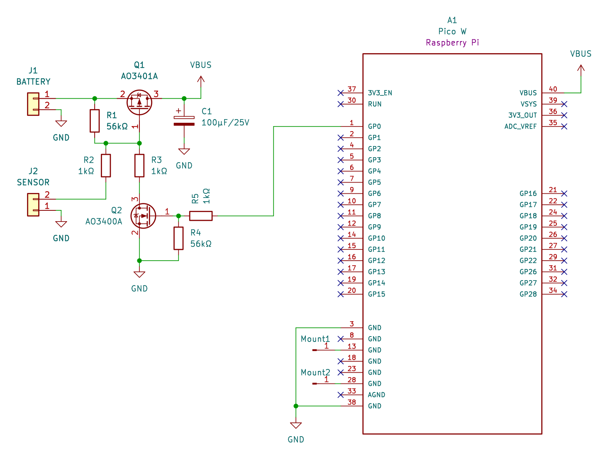
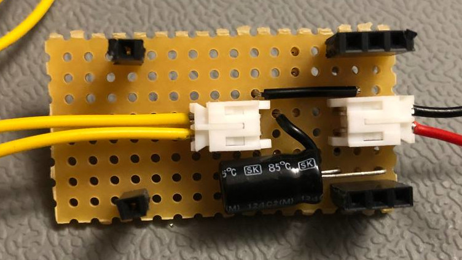
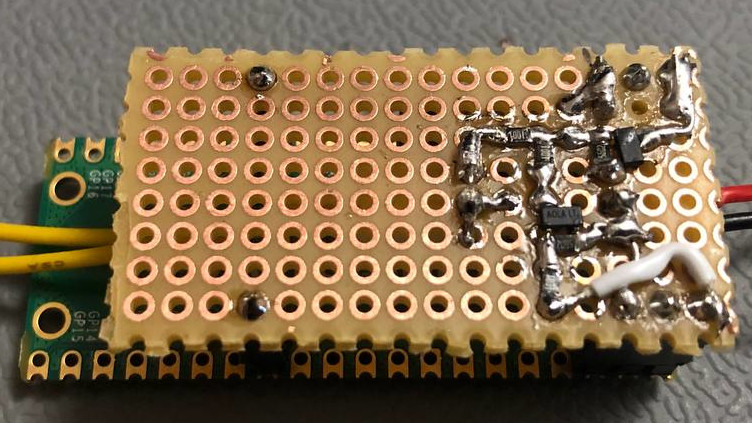

# Wassermelder Hardware

To achieve a practically unlimited battery life, a small circuit is needed.

## description of operation

The voltage from the battery (J1) is disconnected from the Pico W via the P-FET transistor Q1. The resistor R1 pulls the gate of Q1 high and the transistor shut off.
When the water sensor triggers, it pulls the gate of Q1 via R2 low, because the Resistance of R2 is a lot lower than R1. This pulls the gate voltage of Q1 below it's threshold voltage, allowing it to conduct and powering on the Pico W. The capacitor C1 stabilizes the voltage for the Pico W.
The very first action of the Pico W is to pull it's pin GP0 high. This makes The N-FET conductive, further pulling the base of Q1 low, keeping it conductive. Even if the water sensor now resets, the Pico W keeps it's own power supply active.
After the Pico W finishes it's job to to alert via Telegram, it pulls it's pin GP0 low again. Once the water sensor resets, this allows Q1 to stop conducting current, and shutting off all power again.

## Bill of Materials

| Reference  | Part Number   | Description |
|------------|---------------|-------------|
| A1         | SC0918        | Raspberry Pi Pico W |
|            | TODO          | water float switch |
| R1, R4     | 56kΩ 0805     | 56kΩ resistor |
| R2, R3, R5 | 10kΩ 0805     | 10kΩ resistor |
| Q1         | AO3401A       | P-FET transistor |
| Q2         | AO3400A       | N-FET transistor |
| J1, J2     | JST PH2P ST90 | battery and water sensor connectors |

Additionally you need:
- pinheaders and pinsockets with 2,54mm pitch
- a perfboard, suitably sized
- a suitable battery (preferrably a LiIon or LiPo for their voltage)
- a case, e.g. 3D printed

## Hardware construction
I've constructed the circuit on a small perfboard with a combination of SMD and THT parts. Even if the usage of SMD parts on a perfboard is not conventional, it offers a very small layout, and is still hand-solderable with a bit of practice.

## KiCad files
The KiCAD layout isn't a production-ready PCB design. But it shows the rough position and interconnection of the components I chose on the perfboard.